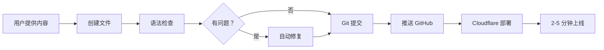

# 🚀 博客管理技能

> Cloudflare Blog Manager Skill - 一站式管理您的 Astro + Cloudflare Pages 博客

## 📖 这是什么？

这是一个专门用于管理部署在 Cloudflare Pages 上的 Astro 博客的技能包。包含完整的文档、工具和模板，帮助您：

- ✅ 发布新文章
- ✅ 上传图片
- ✅ 修改样式
- ✅ 编辑现有内容
- ✅ 自动修复构建错误

## 📁 文件结构

```
blog-manager-skill/
├── README.md           # 本文件 - 技能介绍
├── SKILL.md            # 技能核心定义
├── QUICKSTART.md       # 5 分钟快速入门指南
├── ACTIVATE.md         # 激活说明和触发条件
├── WELCOME.md          # 欢迎指南和使用示例
├── post-template.md    # 文章格式模板
├── blog-manager.sh     # 命令行管理工具
└── .gitignore          # Git 忽略文件
```

## 🎯 如何使用

### 方法 1：通过 AI 助手（推荐）

直接告诉 AI 助手您想做什么：

```bash
# 发布文章
"发布一篇新文章，标题是《我的航海日记》，内容是..."

# 上传图片
"帮我上传这张图片到博客"

# 修改样式
"把博客的 logo 改成圆形"
```

### 方法 2：使用命令行工具

```bash
# 1. 设置 GitHub Token
export GITHUB_TOKEN='ghp_xxxxxxxxxxxx'

# 2. 发布文章
./blog-manager.sh post "文章标题" "文章描述" content.md

# 3. 上传图片
./blog-manager.sh image ./photo.jpg

# 4. 修复 MDX 语法
./blog-manager.sh fix src/content/blog/article.mdx

# 5. 提交推送
./blog-manager.sh deploy "提交信息"
```

## 🚀 快速开始

### 第一步：准备 GitHub Token

1. 访问 https://github.com/settings/tokens
2. 生成新 Token（经典版）
3. **必须勾选 `repo` 权限**
4. 复制 Token（以 `ghp_` 开头）

### 第二步：开始使用

#### 选项 A：通过 AI 助手
```
告诉助手："我的 GitHub Token 是 ghp_xxxxx，我想发布一篇新文章..."
```

#### 选项 B：使用命令行
```bash
chmod +x blog-manager.sh
export GITHUB_TOKEN='ghp_xxxxxxxxxxxx'
./blog-manager.sh --help
```

## 📋 核心功能

### 1. 智能文章发布
- 自动创建 Markdown/MDX 文件
- 设置 frontmatter（标题、描述、日期）
- 检查并修复 MDX 语法问题
- 自动提交和推送
- 触发 Cloudflare 自动部署

### 2. 图片管理
- 上传本地图片文件
- 从 URL 下载图片
- 自动生成引用代码

### 3. 样式定制
- 修改配色方案
- 调整布局
- 修复显示问题

### 4. 错误诊断
- 自动检测 MDX 语法错误
- 分析构建失败原因
- 提供修复建议

## 🔧 自动修复的问题

| 问题 | 修复方式 |
|------|----------|
| `<5` 这样的写法 | 改为"小于 5" |
| HTML 注释 `<!-- -->` | 改为 JSX 注释 `{/* */}` |
| 未闭合的标签 | 自动检测并提示 |
| 格式错误 | 自动修正 |

## 📊 工作流程



## 🎓 学习资源

### 新手必读
1. **WELCOME.md** - 欢迎指南和使用示例
2. **QUICKSTART.md** - 5 分钟快速入门
3. **post-template.md** - 文章格式模板

### 进阶指南
1. **SKILL.md** - 技能核心定义
2. **ACTIVATE.md** - 触发条件和高级用法
3. **README.md** - 完整文档（本文件）

## ⚠️ 注意事项

### Token 安全
- ⚠️ Token 相当于密码，请妥善保管
- ⚠️ 不要提交到 Git 仓库
- ⚠️ 建议设置 90 天过期时间

### MDX 语法
- ❌ 避免 `<5` 这样的写法
- ✅ 改用"小于 5"
- ❌ 不要用 HTML 注释
- ✅ 使用 `{/* JSX 注释 */}`

### 部署时间
- Cloudflare Pages 需要 **2-5 分钟** 部署
- 刷新页面查看更新（Ctrl+F5）

## 🌐 相关链接

- **博客地址**: https://homesh.top/
- **GitHub 仓库**: https://github.com/laona2050/astro-blog-starter-template
- **Cloudflare Dashboard**: https://dash.cloudflare.com/

## 📞 获取帮助

1. 查看 `QUICKSTART.md` 的常见问题部分
2. 参考 `WELCOME.md` 的使用示例
3. 运行 `./blog-manager.sh --help` 查看帮助
4. 询问 AI 助手获取实时帮助

## 🤝 贡献

欢迎提交 Issue 和 Pull Request 来改进这个技能！

---

**版本**: v1.0  
**创建时间**: 2026-03-01  
**维护者**: laona2050  
**许可**: MIT
